# Audit Desain, UX & Konsep — Zii Talk Fase 1

> Riset menyeluruh setelah fase 1 selesai: bug yang ketemu, desain yang kurang pas,
> dan konsep yang perlu dirombak biar app-nya kerasa lebih profesional dan tetap
> enak dipakai waktu topiknya makin banyak.
>
> **Tanggal:** 13 September 2026 · **Cakupan:** Home, Sesi, Bengkel Kalimat,
> Dashboard, form Tambah topik · **Status kode:** commit `d1b3c11` + perubahan
> suara HD & ekspresi yang belum di-commit.
>
> **Update status:** 14 September 2026, sampai commit `931f351`. Lihat
> [Status perbaikan](#status-perbaikan). Temuan di section 1–4 sengaja dibiarkan
> apa adanya (kondisi **sebelum** diperbaiki), begitu juga screenshot di `img/`.

---

## Daftar isi

1. [Ringkasan](#ringkasan)
2. [Status perbaikan](#status-perbaikan)
3. [Cara risetnya](#cara-risetnya)
4. [Bug yang ketemu](#1-bug-yang-ketemu)
5. [Temuan desain per layar](#2-temuan-desain-per-layar)
6. [Sistem visual & aksesibilitas](#3-sistem-visual--aksesibilitas)
7. [Konsep yang perlu dirombak](#4-konsep-yang-perlu-dirombak)
8. [Roadmap usulan](#5-roadmap-usulan)
9. [Keputusan yang perlu kamu ambil](#6-keputusan-yang-perlu-kamu-ambil)
10. [Lampiran](#lampiran)

---

## Ringkasan

Fondasi fase 1 kuat: alur ngomong (push-to-talk, nyela, betulin, Bengkel) matang,
suara HD dan ekspresi jalan, dan datanya udah rapi di Postgres. Yang bikin app ini
**belum kerasa profesional** bukan fiturnya, tapi lima hal ini:

1. **Home nggak siap buat banyak topik.** Dengan 36 topik, Home jadi scroll
   2.899px (±3,4 layar HP) tanpa cari, filter, urutkan, atau kategori. Grup
   topik juga dikunci cuma dua (`daily`/`work`) sampai level database.
2. **Siklus belajarnya putus di tengah.** Frasa bisa disimpan tapi **nggak
   pernah bisa dilihat atau diulang**. Sesi selesai tanpa ringkasan. Dashboard
   cuma ngitung "berapa kali tes", bukan "aku makin lancar atau nggak".
3. **Pengaturan developer nongol di layar utama.** Dropdown model LLM, suara,
   dan instruksi `.env` ada di Home, di atas konten yang mestinya jadi fokus.
4. **Kontras & ukuran teks di bawah standar.** 14 dari 18 pasangan warna yang
   dicek gagal WCAG AA. Ada 51 aturan CSS dengan font di bawah 12px. Beberapa
   tombol lebih kecil dari ukuran jari.
5. **Beberapa bug kelihatan langsung sama user.** Timer rekaman nampil `0:75`,
   avatar Zii jadi kotak buat yang nyalain "kurangi animasi", highlight kata di
   Bengkel lari duluan, dan tombol utama Bengkel labelnya menyesatkan.

### 10 prioritas teratas

| # | Apa | Jenis | Usaha | Status (14 Sep) |
|---|---|---|---|---|
| 1 | Benerin timer rekaman `0:75` | Bug | kecil | **Belum** |
| 2 | Orb Zii jadi kotak saat reduce motion | Bug | kecil | **Beres** |
| 3 | Naikin kontras token warna + ukuran teks minimal 12px | Aksesibilitas | sedang | **Sebagian**: beres di 4 halaman sidebar + form; Sesi & Bengkel belum |
| 4 | Tombol Bengkel: "Pakai & Lanjut" cuma nutup, "Simpan" ketutup | Bug UX | kecil | **Belum** |
| 5 | Pindahin model & suara ke halaman **Pengaturan** | Konsep | sedang | **Beres** |
| 6 | Halaman **Topik** dengan cari, kategori, filter, urutkan | Konsep | besar | **Beres**; edit & arsip topik belum |
| 7 | **Ringkasan sesi** setelah selesai | Konsep | sedang | **Belum** |
| 8 | **Koleksi frasa** yang bisa dilihat & diulang | Konsep | besar | **Belum** |
| 9 | Dashboard → **Progres**: metrik kelancaran, bukan cuma jumlah tes | Konsep | sedang | **Sebagian**: ringkasan & istilah dirapiin; metrik kelancaran belum |
| 10 | Navigasi app yang konsisten (tab bawah di HP, sidebar di laptop) | Konsep | sedang | **Beres** |

---

## Status perbaikan

> Update 14 September 2026.

### Dikerjain di commit mana

| Commit | Isi |
|---|---|
| `022accd` | Navigasi baru (sidebar laptop, tab bar HP), beranda **Latihan**, halaman **Topik** & **Pengaturan**, tabel `categories`, suara HD & ekspresi Zii |
| `078eba9` | Review desain 4 halaman sidebar di laptop, tablet, dan HP: kontras, ukuran teks, layout responsif, Dashboard dirombak ke gaya baru, favicon |
| `931f351` | Sisa target sentuh di HP (tombol status Dashboard, kotak cari Topik, tombol contoh suara) |

Dua commit terakhir ada di branch `design/review-halaman-sidebar`.

**Belum disentuh sama sekali:** layar **Sesi** dan **Bengkel Kalimat**. Semua
temuan di [2.2](#22-sesi-ngobrol), [2.3](#23-bengkel-kalimat),
[4.4](#44-sesi-fokus-ke-obrolan-tutup-dengan-ringkasan), dan
[4.5](#45-bengkel-satu-tujuan-per-layar) masih berlaku.

### Status per area

| Area | Status | Yang udah | Yang belum |
|---|---|---|---|
| Beranda ([2.1](#21-home), [4.2](#42-beranda-latihan-dirancang-buat-100-topik)) | **Beres** | Rekomendasi hari ini (rotasi harian), Terakhir dilatih, Belum pernah dicoba, Waktunya diulang, Jelajah kategori; model & suara pindah ke Pengaturan | Kartu "frasa perlu diulang" (nunggu Koleksi) |
| Navigasi ([4.1](#41-arsitektur-informasi--navigasi)) | **Beres** | 4 tujuan: Latihan, Topik, Dashboard, Pengaturan. Sidebar di laptop, tab bar di HP, disembunyiin saat sesi | Tujuan **Koleksi** |
| Topik ([4.3](#43-halaman-topik-perpustakaan)) | **Sebagian** | Cari, filter kategori & status, 5 urutan, filter ikut URL, daftar ringkas, tambah kategori dari app | Edit, arsip, sematkan topik (`archived_at`, `pinned`, `PATCH`); ikon kategori |
| Pengaturan ([4.8](#48-pengaturan--onboarding)) | **Sebagian** | Suara + contoh, model AI, aturan sesi, status sistem (LLM, Azure, LangSmith) | Kecepatan bicara, ekspresi on/off, koreksi on/off, target jawaban, status database, onboarding |
| Dashboard → Progres ([2.4](#24-dashboard--tambah-topik), [4.7](#47-progres-pengganti-dashboard)) | **Sebagian** | Ringkasan nggak redundan, istilah "sesi", kotak statistik minggir di HP saat detail dibuka, tambah topik pindah ke Topik | Metrik kelancaran (koreksi per 10 jawaban, menit ngomong), grafik mingguan, riwayat lintas topik |
| Kontras ([3.1](#31-kontras-warna-wcag-aa-teks-normal--451)) | **Sebagian** | Token baru `--ink-mute` `#7d6a8e` + warna status `#097c57`/`#be4919` (sesuai usulan tabel 3.1) dipakai di 4 halaman & form; tombol simpan form jadi violet | `--muted`/`--faint` masih dipakai 14× di Sesi & Bengkel; tombol teal/amber/oranye/biru di sesi |
| Ukuran teks ([3.2](#32-ukuran-teks)) | **Sebagian** | Nol teks < 12px di 4 halaman & form | **28 aturan CSS** < 12px tersisa (dulu 51), semuanya di Sesi, Bengkel, rail |
| Target sentuh ([3.3](#33-target-sentuh)) | **Sebagian** | Tombol & kontrol di 4 halaman HP minimal 40–44px | Semua elemen di tabel 3.3 (Sesi & Bengkel) |
| Utang CSS ([3.4](#34-konsistensi--utang-css)) | **Belum** | Favicon | CSS mati (`.fcard`, `.side-head`, `.gloss`, `.pill`, `.dsp`, `.round.plain`) masih ada; hex di CSS 178 (98 unik), `style={{…}}` inline 40; manifest & app icon |
| Sesi ([2.2](#22-sesi-ngobrol), [4.4](#44-sesi-fokus-ke-obrolan-tutup-dengan-ringkasan)) | **Belum** | — | Semua, termasuk ringkasan sesi |
| Bengkel ([2.3](#23-bengkel-kalimat), [4.5](#45-bengkel-satu-tujuan-per-layar)) | **Belum** | — | Semua |
| Koleksi frasa ([4.6](#46-koleksi-frasa--latihan-ulang-fitur-yang-hilang)) | **Belum** | — | API masih cuma `POST /api/phrases` |

### Yang berubah di review desain (`078eba9`, `931f351`)

**Semua halaman sidebar:** teks minimal 12px, kontras lolos AA, tombol di HP
minimal 40–44px, favicon.

**Latihan**

- Grid topik pakai container query: di tablet dan laptop ±1100–1260px nggak ada
  kartu nyangkut sendirian di baris kedua.
- Kartu "Cara kerjanya" nggak bolong lagi waktu ditumpuk.
- Aturan 10 jawaban nggak disebut dua kali.

**Topik**

- HP: cari & status sebaris, "Sudah tersimpan" jadi "Tersimpan", urutkan pindah
  ke baris jumlah hasil, catatan aturan pindah ke bawah daftar. Topik pertama
  naik dari y ±470px ke ±318px.
- Hasil cari kosong: "Reset filter" nggak dobel, urutkan disembunyiin.
- Form tambah topik: teks lebih gede, tombol simpan violet & nempel di bawah
  layar HP, ada petunjuk kenapa belum bisa disimpan.

**Dashboard**

- Gaya disamain sama halaman lain (kartu flat, satu scroll).
- Tabel pakai container query: nama topik nggak kepotong lagi di laptop
  1024–1280px.
- Istilah "tes" jadi "sesi"; 4 kotak ringkasan yang nggak dobel.
- Tombol "Latih lagi" mati kalau AI belum siap; tombol tambah topik cuma di Topik.
- Transkrip & skenario ditandai `lang="en"`.

**Pengaturan**

- Dropdown suara & model bisa diketuk di seluruh kotak, dengan tanda fokus keyboard.
- Status sistem naik ke atas kalau ada yang belum siap; nama variabel `.env`
  nggak pecah di HP.
- Status LangSmith nggak lagi "Siap" kalau API key-nya kosong (`tracing.keyed`
  di `/api/config`).

---

## Cara risetnya

- **Baca semua kode UI:** `Home.tsx`, `Session.tsx` (899 baris), `Bengkel.tsx`,
  `Dashboard.tsx`, `bits.tsx`, `styles.css` (670 baris), plus route & skema
  database yang terkait.
- **Lihat app-nya langsung** lewat Chrome headless yang dikendalikan skrip (Chrome
  DevTools Protocol), di lebar **390px (HP), 768px (tablet), 1024px, dan
  1440px (laptop)**. Hasilnya 26 screenshot, sebagian ada di [`img/`](img/).
- **Simulasi 36 topik** buat ngetes skala Home & Dashboard. Data topik disuntik
  di browser, bukan ditulis ke database.
- **Simulasi sesi di tengah jalan** (obrolan + kartu koreksi + rekaman) dan
  **Bengkel dengan hasil terjemahan**, pakai respons palsu. Nggak ada biaya LLM
  atau Azure.
- **Semua request yang nulis ke database diblok** selama audit. Log audit
  mencatat nol percobaan tulis.
- **Diukur, bukan dikira-kira:** rasio kontras (rumus luminans WCAG) di setiap
  teks yang kelihatan, ukuran tombol, ukuran font, fokus keyboard, dan error
  console.
- **Dibandingin** sama desain asli di `design/` dan pola dari app sejenis (lihat
  [Sumber](#sumber)).

---

## 1. Bug yang ketemu

Semua di bawah udah dicek ke kode dan/atau kelihatan di screenshot, kecuali yang
ditandai *(perlu dicek manual)*. Kolom **Status** dicek ulang ke kode per 14
September 2026; nomor baris di kolom Lokasi masih nomor baris waktu audit.

| # | Bug | Dampak ke user | Lokasi | Prioritas | Status |
|---|---|---|---|---|---|
| B1 | **Timer rekaman nggak pernah jadi menit.** Formatnya `` `0:${secs}` ``, jadi detik ke-75 tampil `0:75`. | Kelihatan rusak tiap ngomong lebih dari 1 menit | [Session.tsx:747](../../src/screens/Session.tsx#L747) | Tinggi | **Belum** |
| B2 | **Orb Zii jadi kotak ungu** kalau sistem user nyalain "kurangi animasi". Bentuk bulatnya cuma datang dari `@keyframes breathe`; begitu animasinya dimatiin, `.orb` nggak punya `border-radius`. | Avatar Zii rusak di Sesi, Dashboard, dan layar loading | [styles.css:70](../../src/styles.css#L70), [:101](../../src/styles.css#L101), [:106](../../src/styles.css#L106) | Tinggi | **Beres** |
| B3 | **Topik "Pilihan hari ini" hilang dari grid dan hitungannya salah.** Grid buang topik hero, jadi "Sehari-hari · 4 topik" padahal ada 5, dan progres topik itu nggak pernah kelihatan. | Angka nggak cocok, topik kayak hilang | [Home.tsx:30-31](../../src/screens/Home.tsx#L30) | Sedang | **Beres** (beranda baru) |
| B4 | **"Pilihan hari ini" nggak pernah ganti.** Di-hardcode `OF_DAY = 'macet'`. | Label "hari ini" bohong | [Home.tsx:6](../../src/screens/Home.tsx#L6) | Sedang | **Beres** (`pickOfDay`) |
| B5 | **Bar progres palsu:** lebarnya 0% atau langsung 100% begitu pernah dites sekali. | Kelihatan "tuntas" padahal baru sekali coba | [Home.tsx:52](../../src/screens/Home.tsx#L52) | Sedang | **Beres** (bar dibuang) |
| B6 | **Highlight kata di Bengkel lari duluan.** Azure ngirim tanda baca sebagai event kata terpisah (`funny`, `!`), sedangkan kalimatnya dipecah per spasi (`funny!`). Tiap koma atau tanda tanya bikin highlight maju satu kata lebih cepat. | Highlight nggak sinkron sama suara | [Bengkel.tsx:174](../../src/components/Bengkel.tsx#L174), [:376](../../src/components/Bengkel.tsx#L376) | Sedang | **Belum** |
| B7 | **Tombol utama Bengkel menyesatkan.** "Pakai & Lanjut Ngobrol" cuma nutup panel, nggak "pakai" apa-apa. Aksi yang beneran nyimpen ("Simpan … ke koleksi frasa") cuma teks abu-abu di bawahnya, dan di HP ketutup, harus scroll dulu. | Frasa jarang kesimpan; user ngira kalimatnya dikirim | [Bengkel.tsx:467](../../src/components/Bengkel.tsx#L467), [:473](../../src/components/Bengkel.tsx#L473) | Tinggi | **Belum** |
| B8 | **Spasi antar kata di kartu Bengkel melebar** ("Could  you  say"), karena tiap kata jadi item flex dengan `gap: 6px`. | Kalimat kelihatan aneh, susah dibaca | [styles.css:382](../../src/styles.css#L382) | Rendah | **Belum** |
| B9 | **`favicon.ico` 404** di tiap halaman. Nggak ada ikon tab, app icon, atau manifest. | Kelihatan belum jadi di tab browser / home screen HP | [index.html](../../index.html) | Rendah | **Sebagian**: favicon SVG ada; app icon & manifest belum |
| B10 | **Label momentum "hari" menyesatkan.** Momentum bukan jumlah hari (bisa naik 1 per hari main, bisa kepotong separuh), tapi tampil "2 hari". | User ngira streak | [Home.tsx:65](../../src/screens/Home.tsx#L65), [Session.tsx:517](../../src/screens/Session.tsx#L517) | Rendah | **Beres** (label "momentum") |
| B11 | **Konfirmasi keluar pakai `window.confirm` bawaan browser.** | Dialog abu-abu bawaan OS, beda gaya sama app | [Session.tsx:485](../../src/screens/Session.tsx#L485) | Rendah | **Belum** |
| B12 | **Bengkel di HP nggak punya backdrop.** Tombol kembali di header sesi masih bisa diketuk selagi Bengkel kebuka. | Bisa keluar sesi nggak sengaja | [styles.css:346](../../src/styles.css#L346) | Rendah | **Belum** |
| B13 | **Dropdown nggak punya tanda fokus keyboard** (`outline: none`). Pas di-Tab, nggak ada yang nyala. | Pengguna keyboard nggak tahu posisinya | [styles.css:186](../../src/styles.css#L186) | Sedang | **Beres** di halaman sidebar & form |
| B14 | **Kartu versi di Bengkel `role="button"` tapi di dalamnya ada tombol lain** (dengerin, pelanin, geser). | Screen reader bingung, interaksi bertumpuk | [Bengkel.tsx:332](../../src/components/Bengkel.tsx#L332) | Rendah | **Belum** |
| B15 | **Teks Inggris nggak ditandai `lang="en"`.** Halamannya `lang="id"`, jadi screen reader ngebaca kalimat Inggris pakai lafal Indonesia. | Aksesibilitas | bubble di Session & Bengkel | Rendah | **Sebagian**: transkrip Dashboard beres; Sesi & Bengkel belum |
| B16 | *(perlu dicek manual)* **Contoh suara bunyi berulang kalau dropdown suara diganti pakai panah keyboard.** Tiap `change` langsung muter preview. | Berisik waktu lihat-lihat suara | [bits.tsx:150](../../src/components/bits.tsx#L150) | Rendah | **Belum dicek** |

<table>
<tr>
<td align="center">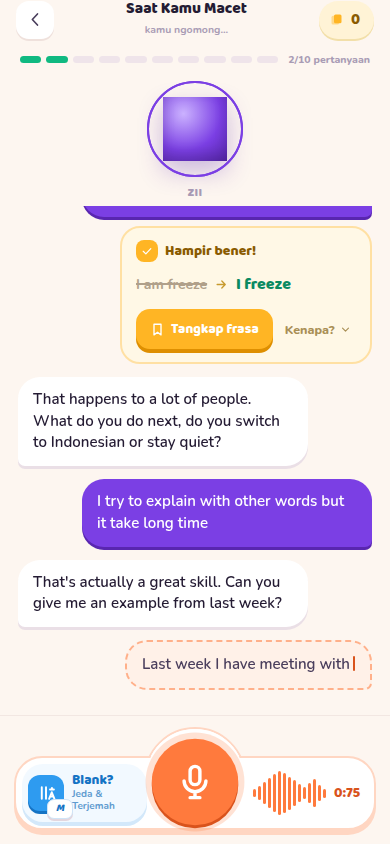<br><sub>B1: timer <code>0:75</code> · B2: orb kotak</sub></td>
<td align="center">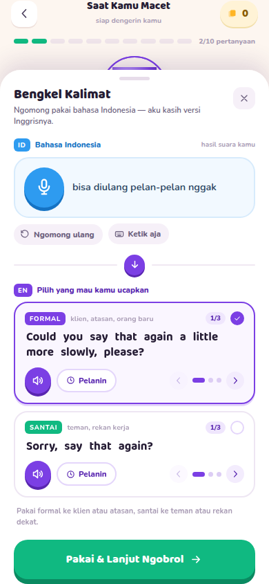<br><sub>B7: "Simpan" ketutup · B8: spasi kata melebar</sub></td>
<td align="center">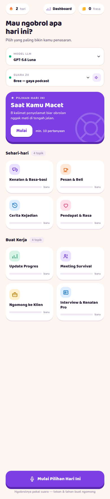<br><sub>B3: "4 topik" padahal 5 · B5: bar kosong semua</sub></td>
</tr>
</table>

---

## 2. Temuan desain per layar

### 2.1 Home

> **Status:** beres. Home diganti beranda **Latihan** (lihat 4.2); daftar semua
> topik pindah ke halaman **Topik**.

<table>
<tr>
<td align="center">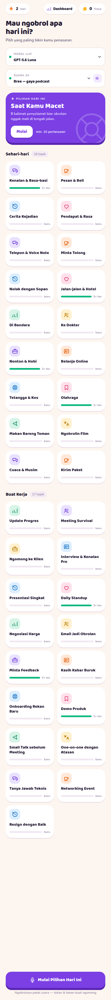<br><sub>36 topik di HP: 2.899px scroll</sub></td>
<td align="center">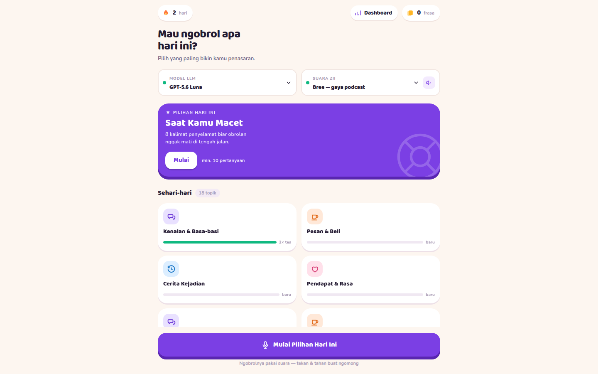<br><sub>36 topik di laptop 1440px</sub></td>
</tr>
</table>

**Masalah skala (yang kamu tanyain):**

- **Semua topik ditumpuk jadi satu grid panjang.** 35 kartu = 2.899px scroll di
  HP. Nggak ada cari, filter, urutkan, atau "lihat semua". Topik yang paling
  relevan (belum dicoba, udah lama nggak dilatih) sama beratnya kayak yang lain.
- **Cuma dua grup, dan dikunci di database:**
  `CHECK (grp IN ('daily', 'work'))` di
  [001_init.sql:5](../../server/migrations/001_init.sql#L5). Nambah kategori
  "Travel" atau "Kesehatan" butuh migrasi skema.
- **Kartu topik isinya minim:** ikon, nama, dan bar palsu (B5). Deskripsi, kapan
  terakhir dilatih, dan jumlah sesi nggak kelihatan. Padahal datanya ada.

**Masalah hierarki:**

- **Pengaturan teknis di atas konten.** "MODEL LLM" dan "SUARA ZII" makan ±130px
  di HP sebelum user lihat satu topik pun. Ini keputusan sekali pakai, bukan
  keputusan tiap buka app.
- **Peringatan untuk developer ditampilin ke user:** "Copy `.env.example` jadi
  `.env`, isi key-nya, terus restart `npm run dev`"
  ([Home.tsx:90](../../src/screens/Home.tsx#L90)).
- **Dua tombol Mulai buat hal yang sama:** tombol "Mulai" di kartu hero dan
  tombol besar "Mulai Pilihan Hari Ini" yang nempel di bawah.
- **Pilih topik lewat klik sekali, mulai lewat klik dua kali**
  ([Home.tsx:44](../../src/screens/Home.tsx#L44)). Klik dua kali nggak ketemu
  sendiri dan nggak ada padanannya di layar sentuh.
- **Navigasi nyamar jadi statistik.** "Dashboard" bentuknya pil yang sama kayak
  "2 hari" dan "0 frasa", jadi nggak kebaca sebagai menu.

**Masalah layout desktop:**

- Konten dikunci di kolom **720px** di layar 1440px. ±700px ruang kosong, dan
  kartu jadi lebar-tipis.
- Tombol CTA yang nempel di bawah **nutupin baris kartu** (lihat screenshot laptop).

### 2.2 Sesi ngobrol

> **Status:** belum digarap. Semua temuan di bawah masih berlaku.

<table>
<tr>
<td align="center">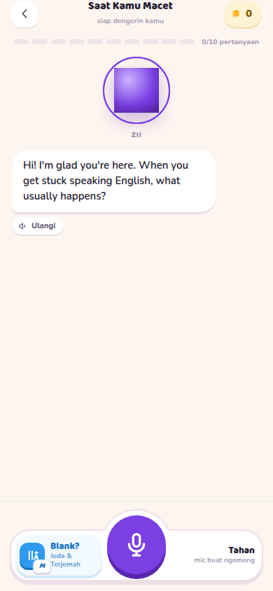<br><sub>Awal sesi di HP</sub></td>
<td align="center">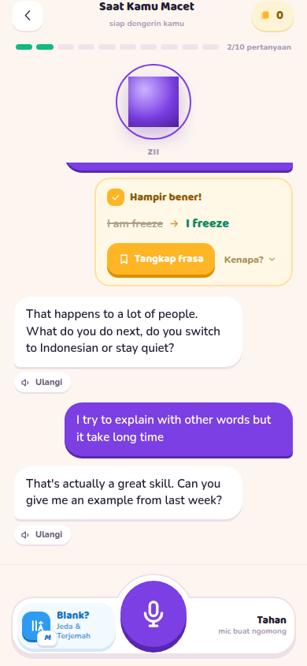<br><sub>Tengah sesi + kartu koreksi</sub></td>
<td align="center">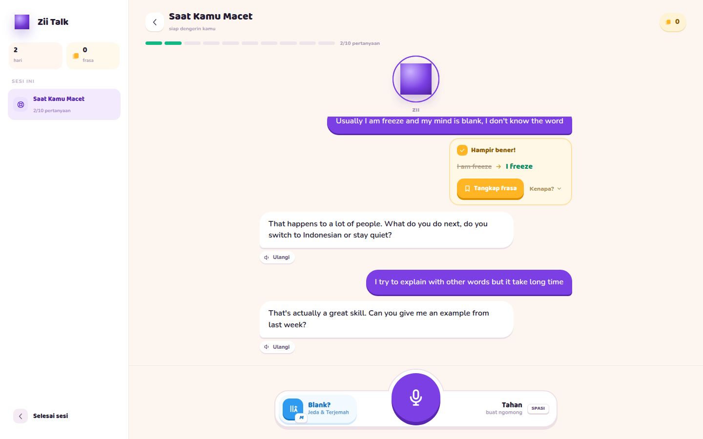<br><sub>Laptop: rail kiri hampir kosong</sub></td>
</tr>
</table>

- **Area obrolan cuma ±61% layar HP.** Header + progres + orb makan ±200px
  (24%) dan dock ±130px (15%). Orb 64px plus cincinnya tetap segede itu walaupun
  obrolannya udah panjang ([Session.tsx:574](../../src/screens/Session.tsx#L574)).
- **Nggak ada ringkasan waktu sesi selesai.** "Selesai sesi" langsung balik ke
  Home. Koreksi, frasa yang ditangkap, durasi, dan "tes #3 tersimpan" nggak
  pernah dirangkum. Ini momen paling pas buat bikin user ngerasa maju.
- **Istilah campur aduk:** progres bilang "2/10 **pertanyaan**", padahal yang
  dihitung jawaban kamu. Dashboard nulis "**Jawaban** 1". Dashboard juga pakai
  "tes", Home pakai "sesi"/"ngobrol".
- **Kartu koreksi selalu "Hampir bener!"**
  ([Session.tsx:864](../../src/screens/Session.tsx#L864)), apa pun kesalahannya.
  Setelah 5 kali jadi hambar.
- **Rail kiri di laptop (264px) isinya cuma satu item** "Sesi ini" plus tombol
  "Selesai sesi". Statistik momentum di rail juga nggak punya ikon api kayak di
  Home.
- **Di 1024px dengan Bengkel kebuka, area obrolan kejepit jadi 400px**
  (1024 − rail 264 − panel 360).
- **Counter frasa di header HP cuma angka** tanpa label atau ikon yang jelas.

### 2.3 Bengkel Kalimat

> **Status:** belum digarap. Semua temuan di bawah masih berlaku.

<table>
<tr>
<td align="center">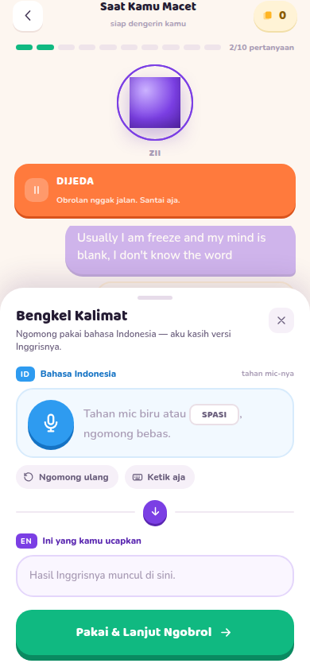<br><sub>HP: sheet tanpa backdrop</sub></td>
<td align="center">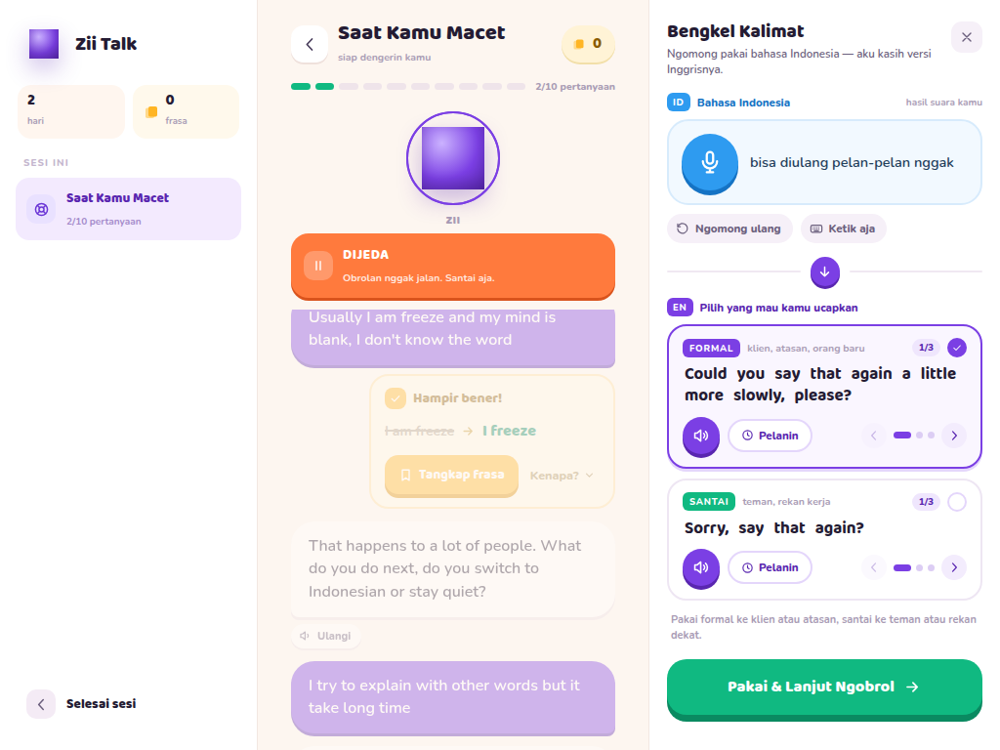<br><sub>1024px: obrolan kejepit 400px</sub></td>
</tr>
</table>

- **Hierarki tombol kebalik (B7).** Aksi paling berharga (simpan frasa) paling
  pudar. Aksi yang cuma nutup panel paling mencolok, dan labelnya bilang "Pakai".
- **Terlalu banyak elemen per kartu:** tag gaya, petunjuk, 1/3, centang, tombol
  dengerin, Pelanin, panah kiri, 3 titik, panah kanan. Tombol panah cuma 26×26px.
- **Konsep dua kartu × tiga pilihan (6 kalimat) berat buat orang yang lagi
  blank.** Pertimbangkan tampilin 1 pilihan terbaik per gaya dulu, dengan tombol
  "pilihan lain".
- **Kalimat Indonesia yang barusan diucapin** nggak bisa diedit langsung; harus
  lewat "Ketik aja", yang ngeganti seluruh kotak.

### 2.4 Dashboard & Tambah topik

> **Status:** sebagian. Kotak statistik redundan, kotak yang dorong detail di
> HP, dan campur fungsi (tambah topik) udah beres; cari & urutkan ada di halaman
> Topik. Edit/arsip topik, bantuan bikin skenario, dan pilihan warna yang lebih
> banyak belum. Kategori sekarang bisa ditambah dari app.

<table>
<tr>
<td align="center">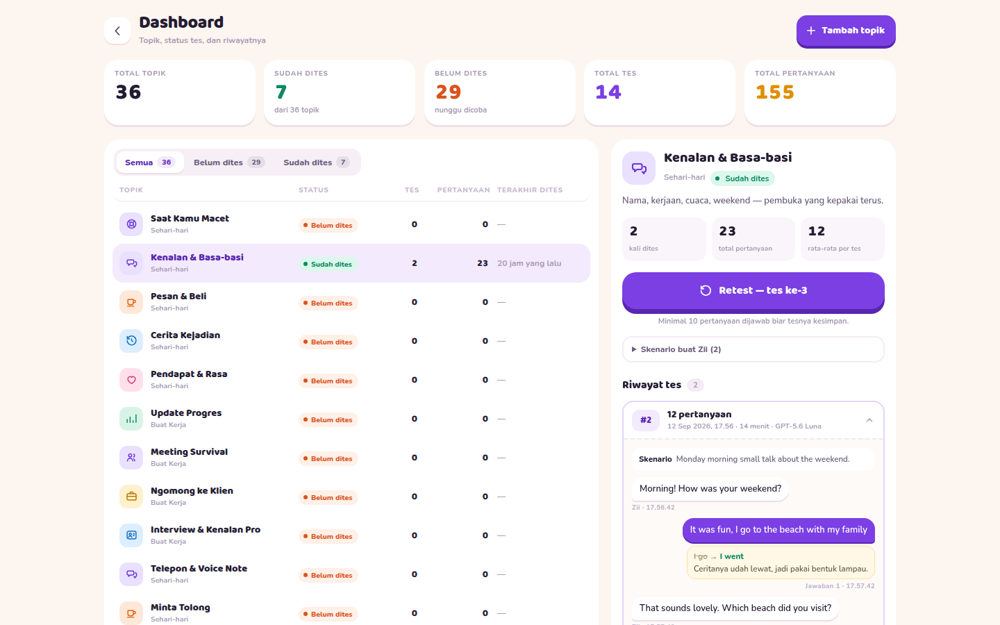<br><sub>Laptop: daftar + detail + transkrip</sub></td>
<td align="center">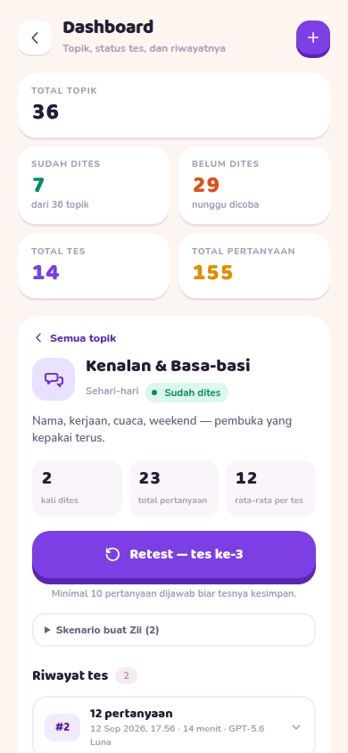<br><sub>HP: 5 kotak statistik dorong detail ke bawah</sub></td>
</tr>
</table>

- **Kotak statistiknya redundan.** "Total topik 36 = Sudah dites 7 + Belum dites
  29" makan tiga kotak ([Dashboard.tsx:150](../../src/screens/Dashboard.tsx#L150)).
  Nggak ada satu pun yang jawab "aku makin lancar?".
- **Di HP, 5 kotak itu tetap nongol di atas detail topik** (±300px) sebelum
  tombol Retest kelihatan.
- **Daftar 36 topik tanpa cari & urutkan.** Filternya cuma sudah/belum dites
  ([Dashboard.tsx:126](../../src/screens/Dashboard.tsx#L126)).
- **Topik cuma bisa ditambah**, nggak bisa diedit, diarsipkan, dihapus, atau
  diurutkan. API-nya cuma `GET` dan `POST`
  ([topics.py:88](../../server/routes/topics.py#L88)).
- **Dashboard campur dua fungsi:** *manajemen topik* (tambah) dan *laporan
  progres* (riwayat tes). Dua-duanya setengah jadi karena nempel di satu layar.
- **Form tambah topik** udah oke (ada pratinjau), tapi grupnya cuma 2 dan
  warnanya cuma 6. Skenario ditulis mentah dalam bahasa Inggris, dan belum ada
  bantuan kayak "bikinin skenario dari deskripsi".

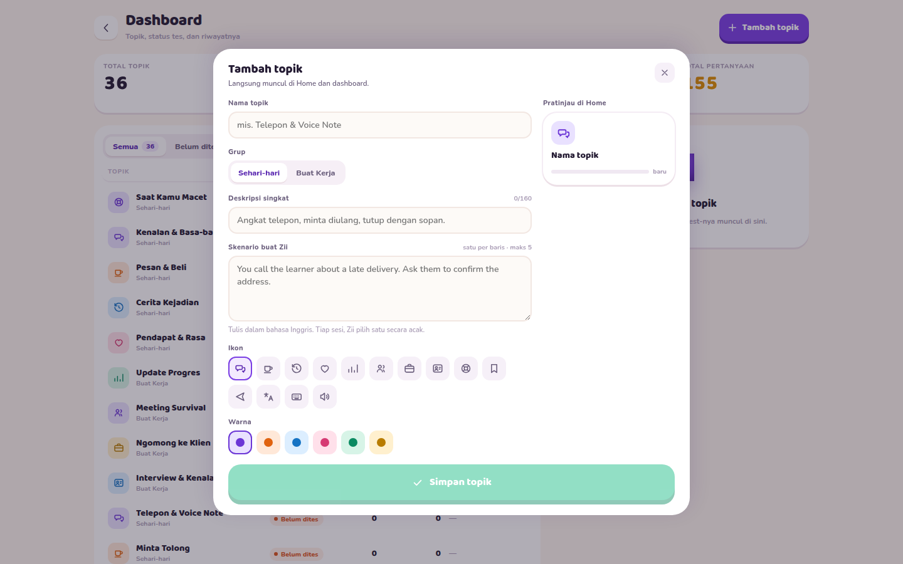

---

## 3. Sistem visual & aksesibilitas

> **Status:** sebagian. Kontras, ukuran teks, dan target sentuh udah beres di 4
> halaman sidebar & form tambah topik (angka di
> [Lampiran](#setelah-perbaikan-14-september-2026)). Sesi & Bengkel belum.

### 3.1 Kontras warna (WCAG AA: teks normal ≥ 4.5:1)

Dihitung dari token asli di [styles.css](../../src/styles.css). Warna pengganti
dihitung supaya lolos di atas **dua** latar (`--paper` dan `--card`), sambil
jaga hue-nya.

| Dipakai buat | Sekarang | Rasio | Usulan | Rasio baru |
|---|---|---|---|---|
| `--muted` (label, sub-teks, di mana-mana) | `#a99cb5` | **2.42** | `#7d6a8e` | 4.54 |
| `--faint` (header tabel, jam transkrip) | `#c4b6ce` | **1.92** | `#836697` | 4.55 |
| Teks putih di tombol teal (Pakai & Lanjut, Simpan) | `#10b981` | **2.54** | `#0c855d` | 4.64 |
| Teks putih di tombol amber (Tangkap frasa) | `#ffb524` | **1.77** | teks `--ink` di atas amber | 9.29 |
| Teks putih di oranye (mic rekam, pita DIJEDA) | `#ff7a3d` | **2.59** | `#d64300` | 4.50 |
| Teks putih di biru (tag ID, ikon Jeda) | `#2e9bf0` | **2.97** | `#0f78cb` | 4.60 |
| Label "Jeda & Terjemah" | `#5f9bcf` | **2.79** | `#3475ad` | 4.57 |
| "Kenapa?" di kartu koreksi | `#a98f55` | **2.94** | `#846f42` | 4.53 |
| Status "Sudah dites" | `#0a8a61` di `#dcf7ec` | **3.85** | `#097c57` | 4.60 |
| Status "Belum dites" | `#d9531c` di `#fff0e8` | **3.63** | `#be4919` | 4.54 |
| Teks biasa `--ink-soft` | `#6b5f7d` | 5.51 | tetap | — |
| Teks putih di violet | `#7b3fe4` | 5.72 | tetap | — |

Pengukuran di halaman nemu **27 teks kontras rendah di Dashboard**, 40 di detail
topik, 24 di Bengkel, dan 9 di sesi HP. Paling parah: "Tangkap frasa" **1.77:1**,
jam di transkrip **1.85:1**, dan header tabel **1.92:1**.

> **Update:** halaman sidebar pakai token baru `--ink-mute` (`#7d6a8e`, nilai
> usulan `--muted`) dan warna status usulan (`#097c57`, `#be4919`). Token
> `--muted` & `--faint` yang lama nggak diubah, masih dipakai 14× di Sesi &
> Bengkel. Tombol teal, amber, oranye, dan biru di sesi belum diganti.

### 3.2 Ukuran teks

- **51 aturan CSS pakai font di bawah 12px**, dan 39 di antaranya ≤ 11px
  (9.5px ×6, 10px ×9, 10.5px ×11, 11px ×13).
- Di Dashboard HP ada **73 teks 10.5px** dan **70 teks 9.6px** yang kelihatan
  sekaligus.
- Label kecil yang juga pakai warna `--muted` = kecil **dan** pudar. Ini yang
  paling bikin kesan "belum rapi".

**Usulan skala tipografi** (6 langkah, bukan 26 ukuran kayak sekarang):
`12 · 14 · 16 · 20 · 24 · 32`. Label kapital boleh 12px dengan `letter-spacing`;
nggak ada teks di bawah 12px.

> **Update:** tinggal **28 aturan** di bawah 12px, semuanya di Sesi, Bengkel,
> dan rail sesi. Di 4 halaman sidebar & form tambah topik nggak ada teks yang
> kelihatan di bawah 12px. Skala tipografi 6 langkah belum dijadiin token.

### 3.3 Target sentuh

Acuan: WCAG 2.2 SC 2.5.8 minimal 24×24px; pedoman iOS/Android 44–48px.

| Elemen | Ukuran sekarang |
|---|---|
| Panah pilihan Bengkel | 26×26 |
| Chip "Ulangi" di bubble | 72×25 |
| Tutup Bengkel (×) | 32×32 |
| Tab filter Dashboard | ±100×31 |
| "Kenapa?" | 75×33 |
| Tombol kembali | 38×38 |

> **Update:** tab filter Dashboard sekarang 40px di layar sentuh. Elemen Sesi &
> Bengkel di tabel ini belum diubah.

### 3.4 Konsistensi & utang CSS

- **123 kode warna hex ditulis langsung** (59 unik) di luar token, ditambah
  **44 `style={{…}}` inline** di TSX. Ganti tema atau dark mode jadi mustahil
  tanpa bongkar semua.
- **CSS mati** dari desain asli yang nggak jadi dibangun: `.fcard`, `.side-head`
  (panel "Koleksi Frasa"), `.gloss`, `.pill`, `.dsp`, `.round.plain`.
- **Fokus keyboard cuma dirancang di satu tempat** (`.ver:focus-visible`). Selain
  itu ngandelin outline bawaan browser, atau dimatiin sama sekali (B13).
- **Nggak ada dark mode, favicon, atau manifest PWA**, padahal app ini
  mobile-first dan punya `theme-color`.

> **Update:** belum digarap. Hex di `styles.css` malah naik jadi **178 (98 unik)**
> karena halaman baru; inline style 40. CSS mati masih ada. Favicon udah ada,
> manifest & dark mode belum. Fokus keyboard sekarang dirancang di navigasi,
> tombol, chip, dropdown, dan baris daftar.

### 3.5 Kenapa kesannya "kurang profesional"

Identitas visualnya kuat (violet, orb, Baloo 2), tapi dipakai terlalu keras di
**semua** tempat:

- **Bayangan 3D (`box-shadow: 0 6px 0`) di hampir semua tombol dan kartu.**
  Kalau semuanya menonjol, nggak ada yang menonjol.
- **Bobot font 800 di mana-mana**, termasuk label 10px dan angka tabel.
- **Animasi lucu di elemen serius** (kartu koreksi `wiggleIn`, `flipin`).
- **Bahasanya slang di pesan error dan instruksi teknis** ("belum kebaca", "cek
  .env dulu").

**Arah yang disarankan: "hangat tapi tenang".** Pertahankan violet dan orb
sebagai identitas, tapi:

- 3D shadow cuma buat **satu aksi utama per layar** (mic, Mulai). Sisanya flat
  dengan border halus.
- Judul Baloo 2 700, isi Nunito 400/600, angka pakai `tabular-nums`.
- Warna fungsional (amber/teal/oranye) cuma buat **status**, bukan dekorasi.
- Nada bahasa tetap santai di obrolan, tapi jelas dan baku di error, pengaturan,
  dan konfirmasi.

> **Update:** 4 halaman sidebar & form udah pakai arah ini (kartu flat bertepi
> tipis, judul 700, angka `tabular-nums`, 3D dibuang dari Dashboard). Sesi &
> Bengkel masih gaya lama.

---

## 4. Konsep yang perlu dirombak

### 4.1 Arsitektur informasi & navigasi

> **Status:** beres, tanpa Koleksi. Yang dibangun: Latihan, Topik, Dashboard
> (belum jadi Progres), Pengaturan. Di HP, Pengaturan jadi tab ke-4 (bukan ikon
> di header).

Sekarang cuma ada dua halaman (`/` dan `/dashboard`), dan navigasinya berupa pil
kecil. Usulan: **lima tujuan jelas**, dengan navigasi yang sama di semua layar
(kecuali saat sesi berlangsung).

| Tujuan | Isi | Menggantikan |
|---|---|---|
| **Latihan** (beranda) | Lanjutkan, rekomendasi hari ini, frasa yang perlu diulang | Home sekarang |
| **Topik** | Perpustakaan: cari, kategori, filter, urutkan, kelola | Grid Home + daftar Dashboard |
| **Koleksi** | Frasa tersimpan + latihan ulang | (belum ada) |
| **Progres** | Tren kelancaran, riwayat sesi, transkrip | Dashboard sekarang |
| **Pengaturan** | Model, suara, kecepatan, ekspresi, koreksi, diagnostik | Dropdown di Home |

- **HP:** tab bar bawah dengan 4 tujuan; Pengaturan lewat ikon di header Latihan.
- **Laptop:** sidebar kiri (pakai ulang gaya `.rail` yang udah ada) yang sama di
  semua halaman, nggak cuma di sesi.
- **Saat sesi:** navigasi disembunyiin; cuma header sesi + tombol keluar.

### 4.2 Beranda "Latihan": dirancang buat 100+ topik

> **Status:** beres, tanpa kartu "frasa perlu diulang" (nunggu Koleksi).
> "Lanjutkan" dibangun sebagai kartu **Terakhir dilatih**, plus baris **Belum
> pernah dicoba** dan **Waktunya diulang**.

Beranda **nggak lagi nampilin semua topik**, tapi mutusin buat user:

```
┌────────────────────────────────┐
│ Hai! 🔥 momentum 5      ⚙      │
│                                │
│ ▶ LANJUTKAN                    │  ← sesi/topik terakhir, 1 ketuk
│   Meeting Survival · 6/10      │
│                                │
│ ★ REKOMENDASI HARI INI         │  ← rotasi harian yang beneran
│   Negosiasi Harga              │     (prioritas: belum dicoba /
│   belum pernah dicoba   [Mulai]│      paling lama nggak dilatih)
│                                │
│ ↻ 4 FRASA PERLU DIULANG  [Ulang]│  ← dari Koleksi
│                                │
│ Jelajah                  Semua›│
│ [Sehari-hari][Kerja][Travel]…  │  ← chip kategori → halaman Topik
│ ◻ Minta Tolong   ◻ Di Bandara  │  ← maks 4–6 kartu
│ ◻ Daily Standup  ◻ Ke Dokter   │
└────────────────────────────────┘
```

**Aturan "Rekomendasi hari ini" (ganti B4):** urutkan topik berdasarkan (1)
belum pernah dicoba, lalu (2) paling lama nggak dilatih. Pilih satu secara
deterministik per tanggal, supaya tetap sama seharian dan ganti besoknya. Nggak
butuh tabel baru; cukup data `topic_stats` yang udah ada.

### 4.3 Halaman "Topik": perpustakaan

> **Status:** sebagian. Cari, filter kategori & status, urutkan, daftar ringkas,
> dan tabel `categories` udah jadi. Kelola (edit, arsip, sematkan, atur urutan),
> `categories.icon`, `topics.archived_at`, `topics.pinned`, dan endpoint `PATCH`
> / `archive` belum.

```
┌─────────────────────────────────────────────┐
│ Topik                          [+ Tambah]   │
│ 🔍 Cari topik...                             │
│ [Semua 36][Sehari-hari 18][Kerja 17][Travel] │  ← kategori
│ Status: [Semua ▾]  Urutkan: [Terlama dilatih ▾] │
│ ─────────────────────────────────────────── │
│ 💬 Kenalan & Basa-basi        2 sesi · 20j  │  ← baris ringkas, bukan kartu besar
│    Nama, kerjaan, cuaca...                  │
│ ☕ Pesan & Beli               belum dicoba  │
│ ...                                         │
└─────────────────────────────────────────────┘
```

- **Tampilan daftar ringkas** jadi default. Muat 8–10 topik per layar HP,
  dibanding sekarang ±4 kartu.
- **Cari** dari nama + deskripsi. **Filter** kategori + status. **Urutkan**:
  terlama dilatih, terbaru ditambah, A–Z, paling sering.
- **Kelola:** edit, arsipkan (bukan hapus, supaya riwayat tes aman), sematkan
  favorit, atur urutan.
- **Info kartu yang berguna:** kategori, jumlah sesi, kapan terakhir, dan
  (setelah 4.7 ada) tren koreksi. Buang bar palsu.

**Perubahan data yang dibutuhin:**

- Tabel `categories (id, name, icon, sort_order)` + `topics.category_id`,
  menggantikan `CHECK (grp IN ('daily','work'))`. Data lama dimigrasi jadi dua
  kategori awal.
- Kolom `topics.archived_at`, `topics.pinned`.
- Endpoint `PATCH /api/topics/{id}` dan `POST /api/topics/{id}/archive`.

### 4.4 Sesi: fokus ke obrolan, tutup dengan ringkasan

> **Status:** belum digarap.

- **Header ringkas:** begitu ada ≥2 bubble, orb besar menyusut jadi avatar kecil
  di header. Area obrolan naik dari ±61% jadi ±75% layar HP.
- **Istilah dirapiin:** "2/10 jawaban", konsisten di sesi, ringkasan, dan
  Progres.
- **Dialog keluar pakai komponen app** (ganti B11), dengan pilihan jelas:
  "Lanjut ngobrol" / "Keluar tanpa simpan".
- **Kartu koreksi yang lebih informatif:** judul menyesuaikan jenis kesalahan
  ("Bentuk lampau", "Urutan kata"). Butuh field `kind` dari node `review`.
- **Layar ringkasan sesi (baru):**

```
┌────────────────────────────────┐
│        ✓ Tes #3 tersimpan       │
│   Kenalan & Basa-basi · 14 mnt  │
│                                │
│   12 jawaban · 3 koreksi        │
│   ▼ lebih sedikit dari tes #2 (5)│  ← perbandingan sama sesi sebelumnya
│                                │
│   YANG DIBETULIN                │
│   I go → I went                 │
│   I am freeze → I freeze        │
│                                │
│   FRASA DITANGKAP (2)           │
│   "I freeze and my mind..."     │
│                                │
│  [Ulangi topik]  [Topik lain]   │
└────────────────────────────────┘
```

Semua datanya udah ada: `messages.correction`, `test_runs.started_at/ended_at`,
dan tes sebelumnya di topik yang sama. Pola ini standar di app sejenis (Loora
nampilin ringkasan setelah tiap sesi).

### 4.5 Bengkel: satu tujuan per layar

> **Status:** belum digarap.

- **Ganti label & hierarki (B7):**
  - Tombol utama: **"Simpan frasa"** (atau "Tersimpan ✓").
  - Tombol sekunder: **"Balik ngobrol"** (dan `Esc`).
  - Keduanya sejajar di bawah, selalu kelihatan tanpa scroll.
- **Tampilan bertahap:** tampilin **1 pilihan terbaik** Formal + 1 Santai dulu,
  plus tombol "2 pilihan lain". Buat orang yang lagi blank, 6 kalimat itu
  terlalu banyak.
- **Backdrop di HP** (ganti B12), dan ketuk backdrop = tutup.
- **Spasi natural (B8):** render kalimat sebagai teks biasa. Highlight pakai
  `<mark>` per rentang karakter dari `textOffset` word boundary, bukan hitungan
  event. Ini sekaligus benerin B6.

### 4.6 Koleksi frasa + latihan ulang (fitur yang hilang)

> **Status:** belum digarap. Jumlah frasa tampil di sidebar & beranda, tapi
> belum ada layar atau endpoint buat ngebacanya.

Sekarang frasa **cuma bisa masuk** ([state.py:102](../../server/routes/state.py#L102)),
nggak ada endpoint baca dan nggak ada layarnya. Desain aslinya punya panel
"Koleksi Frasa" (`design/Desktop.dc.html`), tapi yang tersisa di kode cuma
CSS-nya.

**Layar Koleksi:**

- Daftar frasa: Inggris, arti Indonesia, asal topik, tanggal. Bisa dicari &
  difilter per topik.
- Tiap frasa: dengerin (suara Zii), hapus, "ucapin sekarang".

**Latihan ulang ringan** (spaced repetition sederhana ala kotak Leitner):

1. Zii ngucapin arti Indonesianya → user ngomong versi Inggrisnya (STT yang
   udah ada).
2. Dicocokkan longgar (abaikan tanda baca/kapital) → "Pas" / "Hampir" /
   "Belum".
3. Pas → jadwal berikutnya lebih lama (1 → 3 → 7 → 14 hari). Belum → besok lagi.

**Data:** tambah kolom `phrases.box`, `phrases.next_review_at`,
`phrases.last_result`, plus endpoint `GET /api/phrases`,
`DELETE /api/phrases/{id}`, `POST /api/phrases/{id}/review`. Kartu "4 frasa
perlu diulang" di beranda baca dari `next_review_at <= now()`.

Ini pola yang umum di app belajar bahasa: Memrise punya "My words", Busuu dan
Ling punya bank kosakata yang diulang otomatis, dan review yang nempel ke
konteks obrolan disebut jadi pembeda app speaking yang serius (lihat
[Sumber](#sumber)).

### 4.7 Progres (pengganti Dashboard)

> **Status:** sebagian. Kotak "total / sudah / belum" udah diganti 4 kotak: sesi
> tersimpan, total jawaban (+ rata-rata per sesi), belum dicoba, dan terakhir
> latihan. Di HP kotaknya minggir waktu detail dibuka, dan manajemen topik udah
> pindah ke Topik. Metrik kelancaran, grafik mingguan, dan riwayat lintas topik
> belum. Namanya masih "Dashboard".

Ganti kotak "total topik / sudah / belum" dengan angka yang jawab **"aku makin
lancar?"**. Semuanya bisa dihitung dari tabel yang udah ada:

| Metrik | Dari mana |
|---|---|
| Menit ngomong minggu ini | `test_runs.ended_at − started_at` |
| Jawaban minggu ini | `count(messages where role='me')` |
| **Koreksi per 10 jawaban** (turun = membaik) | `messages.correction is not null` / jawaban |
| Frasa tersimpan / sudah hafal | `phrases`, `phrases.box` |
| Topik aktif 7 hari terakhir | `test_runs.topic_id` distinct |

- **Grafik mingguan sederhana:** jawaban & koreksi per 10 jawaban, 8 minggu
  terakhir.
- **Riwayat sesi lintas topik** (sekarang cuma bisa per topik) dengan transkrip
  yang udah ada.
- **Di HP:** detail sesi jadi halaman sendiri; kotak statistik nggak ikut di
  atasnya.
- **Manajemen topik pindah** ke halaman Topik (4.3).

### 4.8 Pengaturan & onboarding

> **Status:** sebagian. Halaman Pengaturan udah ada: suara + contoh, model AI,
> aturan sesi, dan status sistem (LLM, Azure Speech, LangSmith). Kecepatan
> bicara, ekspresi on/off, koreksi on/off, target jawaban, status database, dan
> onboarding belum.

**Pengaturan:**

- Suara Zii + contoh.
- Model AI.
- Kecepatan bicara Zii.
- Ekspresi suara on/off.
- Tampilkan koreksi selama sesi on/off.
- Target jawaban per sesi (sekarang di-hardcode 10).
- **Diagnostik:** status LLM / Azure / database, dengan pesan `.env` yang
  sekarang ada di Home.

**Onboarding pertama kali (3 langkah):**

1. Izin mikrofon + tes suara.
2. Cara ngomong: tahan mic / `SPASI`, ketuk lagi buat betulin, `M` buat Bengkel.
3. Pilih suara Zii + 2–3 topik minat → isi "Rekomendasi hari ini" pertama.

Praktika dan Loora sama-sama pakai onboarding yang nanya minat buat nyusun
rencana latihan (lihat [Sumber](#sumber)).

### 4.9 Kamus istilah (biar konsisten)

> **Status:** dipakai di 4 halaman sidebar (Dashboard udah ganti "tes" jadi
> "sesi"). Sesi & Bengkel belum dicek ulang.

| Pakai | Jangan campur dengan | Arti |
|---|---|---|
| **Sesi** | tes, obrolan | Satu kali latihan dengan Zii |
| **Sesi tersimpan** | tes | Sesi yang sampai target jawaban |
| **Jawaban** | pertanyaan | Satu giliran kamu ngomong |
| **Koreksi** | fix, hampir bener | Kartu kuning pembetulan |
| **Frasa** | kartu, koleksi | Kalimat yang kamu simpan |
| **Momentum** | hari, streak | Skor konsistensi (bukan jumlah hari) |

---

## 5. Roadmap usulan

Dicentang = beres per 14 September 2026.

### Fase 1.5 — Rapiin yang ada (± 2–3 hari)

- [ ] B1 timer menit:detik
- [x] B2 orb punya `border-radius` dasar
- [x] B3 + B4 + B5 hero, rotasi harian, buang bar palsu
- [ ] B7 + B8 + B6 tombol Bengkel, spasi kata, highlight pakai offset
- [ ] Token warna AA (tabel 3.1) + minimal font 12px + fokus keyboard — *beres di 4 halaman sidebar & form; Sesi & Bengkel belum*
- [ ] Favicon, app icon, manifest — *favicon beres; app icon & manifest belum*
- [ ] Istilah (4.9) + konfirmasi keluar in-app — *istilah beres di halaman sidebar; konfirmasi keluar belum*
- [ ] Hapus CSS mati; pindahin hex & inline style ke token

### Fase 2a — Struktur (± 1–2 minggu)

- [x] Navigasi app (tab bar HP, sidebar laptop)
- [x] Halaman **Pengaturan** (model & suara pindah dari Home)
- [x] Tabel **kategori** + halaman **Topik** (cari, filter, urutkan)
- [ ] **Edit & arsip** topik
- [x] Beranda **Latihan** baru (Lanjutkan, Rekomendasi, Jelajah)

### Fase 2b — Siklus belajar (± 1–2 minggu)

- [ ] **Ringkasan sesi**
- [ ] **Koleksi frasa** + latihan ulang
- [ ] **Progres** dengan metrik kelancaran — *ringkasan & istilah Dashboard udah dirapiin*

### Fase 2c — Poles (menyusul)

- [ ] Onboarding pertama kali
- [ ] Dark mode (setelah token warna rapi)
- [ ] Pecah `Session.tsx` (sekarang 906 baris) jadi komponen kecil
- [ ] Jadiin skrip audit visual ini bagian dari cek rutin sebelum rilis

### Urutan berikutnya yang disarankan

1. **Bug kecil di Sesi & Bengkel:** B1, B7, B8 + B6, B11, B12. Usahanya kecil
   dan kelihatan langsung sama user.
2. **Kontras & ukuran teks di Sesi & Bengkel,** biar standarnya sama kayak
   halaman sidebar.
3. **Ringkasan sesi,** yang datanya udah lengkap.
4. **Koleksi frasa,** yang angkanya udah nongol di sidebar tapi belum bisa dibuka.

---

## 6. Keputusan yang perlu kamu ambil

Jawaban ini ngubah desain fase 2:

1. **Satu pengguna atau nanti banyak pengguna (login)?** Sekarang `app_state`
   cuma satu baris. Kalau mau dibagi ke orang lain, Koleksi & Progres harus
   per-user dari awal.
2. **Prioritas perangkat: HP atau laptop?** Menentukan navigasi mana yang
   dirancang duluan.
3. **Arah visual:** tetap ceria ala Duolingo tapi lebih rapi, atau lebih kalem
   ala Speak/Loora? Section 3.5 ngusulin di tengah-tengah.
4. **Perlu level kesulitan per topik** (misal A2/B1/B2)? Kalau iya, masukin ke
   tabel kategori/topik sekalian di Fase 2a.
5. **"Tes minimal 10 jawaban" tetap jadi syarat tersimpan**, atau semua sesi
   dicatat (dengan tanda "lengkap/belum")? Ini ngaruh ke angka di Progres.

---

## Lampiran

### Angka pengukuran

#### Waktu audit (13 September 2026)

| Layar | Teks dicek | Kontras rendah | Tombol < 44px | Font < 12px |
|---|---|---|---|---|
| Home HP | 36 | 7 | 4 | 17 |
| Home HP, 36 topik | 90 | 11 | 4 | 44 |
| Dashboard laptop, 36 topik | 244 | 27 | 4 | 87 |
| Detail topik laptop | 279 | 40 | 4 | 106 |
| Dashboard HP | 300 | 23 | 5 | 185 |
| Form tambah topik | 261 | 32 | 29 | 99 |
| Sesi HP (awal) | 12 | 5 | 2 | 6 |
| Sesi HP (tengah) | 23 | 9 | 6 | 8 |
| Bengkel HP (hasil) | 81 | 24 | 24 | 23 |
| Sesi laptop | 33 | 12 | 6 | 13 |
| Bengkel laptop | 90 | 27 | 24 | 27 |

- Horizontal overflow: **nggak ada** di semua layar yang dicek.
- Error console: cuma `favicon.ico` 404. Error `/api/speech/token` 503 sengaja
  dari audit, karena Azure dimatiin.
- Kontras dihitung dengan rumus luminans relatif WCAG 2.x terhadap latar efektif
  (warna latar induk + opacity). Latar gradien diabaikan, jadi teks di atas orb
  atau gradien bisa sedikit meleset.

#### Setelah perbaikan (14 September 2026)

Diukur dengan cara yang sama, sampai commit `931f351`, dengan AI & Azure Speech
aktif (tombol Mulai nyala). HP = 375px dengan layar sentuh, laptop = 1280px.
Sesi & Bengkel nggak diukur ulang karena belum diubah.

| Layar | Kontras rendah | Font < 12px | Kontrol < 44px | Overflow |
|---|---|---|---|---|
| Latihan HP | 0 | 0 | 0 | nggak ada |
| Topik HP | 0 | 0 | 5 (tombol status 40px ×3, kotak cari 42px, urutkan 42px) | nggak ada |
| Form tambah topik HP | 0 | 0 | 0 | — |
| Dashboard HP | 0 | 0 | 3 (tombol status 40px) | nggak ada |
| Pengaturan HP | 0 | 0 | 0 | nggak ada |
| Latihan laptop | 0 | 0 | 2 link teks tingginya 19px ("Lihat semua", "Semua topik") | nggak ada |
| Topik laptop | 0 | 0 | kotak ketik cari 22px (bingkainya 44px) | nggak ada |
| Dashboard laptop | 0 | 0 | 0 | nggak ada |
| Pengaturan laptop | 0 | 0 | 0 | nggak ada |

- Kolom kontrol HP pakai acuan 44px, laptop pakai acuan WCAG 24px.
- Nama topik kepotong di Dashboard: **nol** di 1024px, 1280px, dan HP (dulu
  "Saat K…" di 1280px).
- Data sesi contoh dipakai sementara buat ngecek kartu "Terakhir dilatih" dan
  transkrip, lalu dihapus lagi dari database.

### Screenshot

Semua di [`img/`](img/), diambil dengan data asli + simulasi waktu audit
(kondisi **sebelum** perbaikan):
`home-m-full`, `home-d`, `home-many-m-full`, `home-many-d`, `sess-open-m`,
`sess-mid-m`, `sess-rec-m`, `sess-mid-d`, `bengkel-empty-m`, `bengkel-result-m`,
`bengkel-result-d`, `bengkel-result-1024`, `dash-many-d`, `dash-detail-d`,
`dash-detail-m`, `form-d`.

### Sumber

- [AI Voice Language Learning Apps – ISSEN (Juli 2026)](https://www.issen.com/blog/ai-language-learning-apps-voice-practice/): Loora (role-play, pelajaran harian, ringkasan setelah sesi), Praktika (rencana harian dari minat, onboarding), review kosakata yang nempel ke obrolan
- [Best AI English Speaking Apps – ISSEN](https://www.issen.com/blog/best-ai-apps-for-learning-english-speaking/)
- [10 Best AI Language Learning Apps for Speaking – Talkio](https://www.talkio.ai/blog/best-ai-language-speaking-practice-apps-in-2026)
- [App Showcase: Loora AI – ScreensDesign](https://screensdesign.com/showcase/speak-english-with-loora-ai)
- [Praktika](https://praktika.ai/)
- [8 Best Spaced Repetition Apps – Lingopie](https://lingopie.com/blog/spaced-repetition/): Memrise "My words", Busuu vocabulary trainer
- [Best Spaced Repetition Apps for Vocabulary – Ling](https://ling-app.com/blog/best-spaced-repetition-apps-for-vocabulary/)
- [Spaced Repetition – Busuu](https://www.busuu.com/en/languages/spaced-repetition)
- WCAG 2.2: SC 1.4.3 Contrast (Minimum), SC 2.5.8 Target Size (Minimum), SC 2.4.7 Focus Visible, SC 3.1.2 Language of Parts
